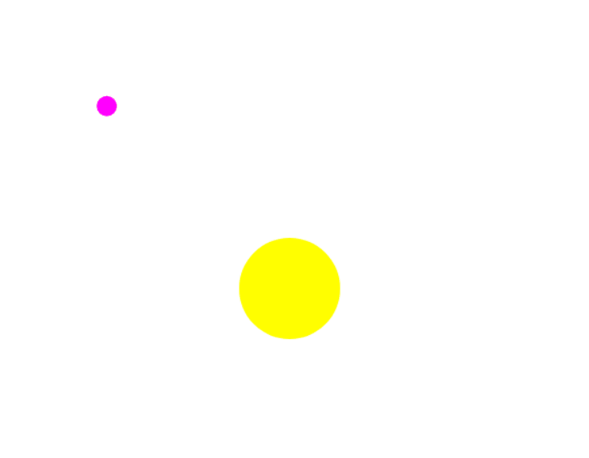
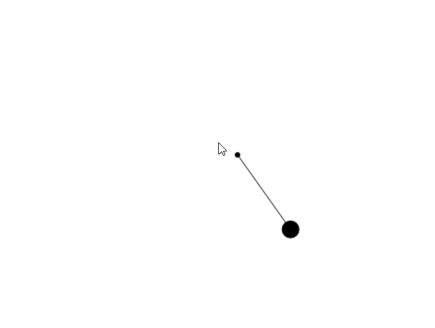
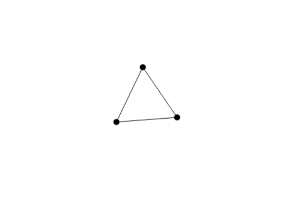

# Particle simulator 2D physics

## Description

This Web App can simulate particles, projectiles, gravity, spring forces. Created multiple animations and a 2D tearable cloth mesh which can interact with different external forces. It has been built by constructing a 2D vector and particle library in Javascript with animations done using Canvas api in the browser.

### Some of the demo animations made using this library. *( hover over images for file names )*

  
  
  
  
  

 

### Combining constrained spring into a mesh grid to create a cloth effect

simulating wind effect with help of repulsion and spring breaking when tension exceeded

  
  

 

### To run the demos simply replace **line 34 in index.html** with the desired animation from **demonstrations**

